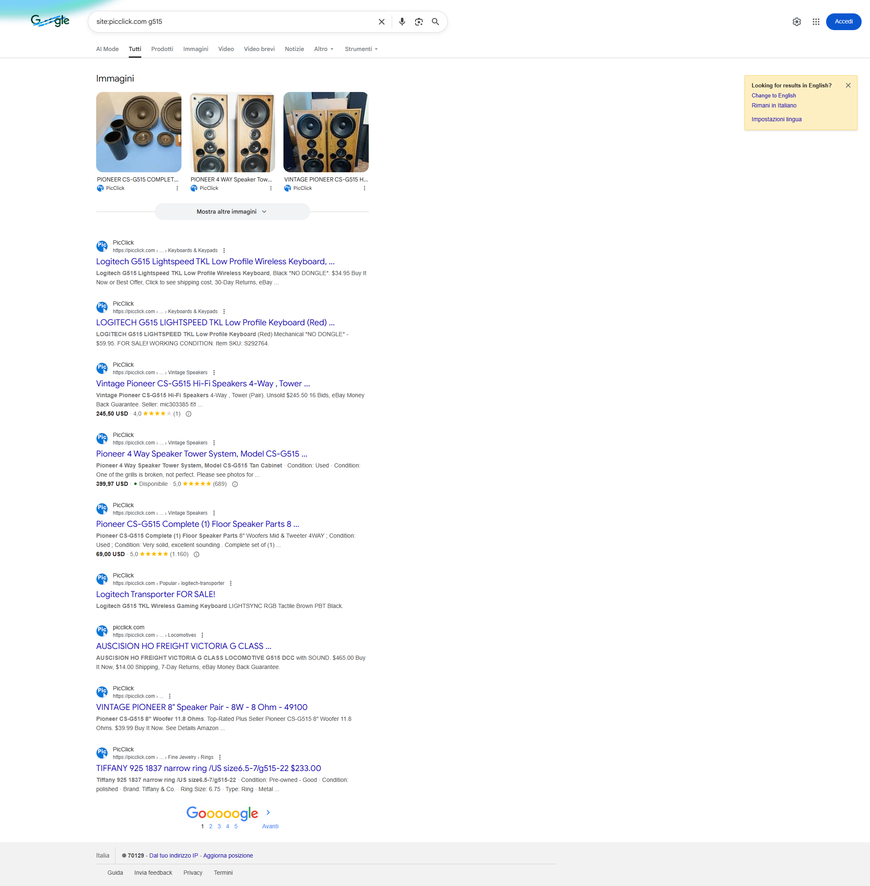
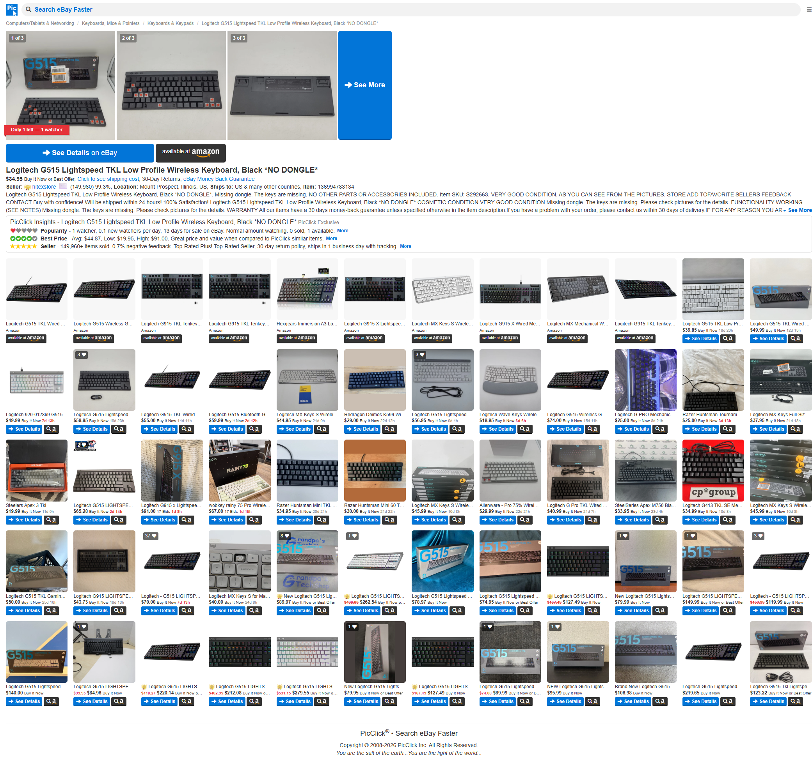
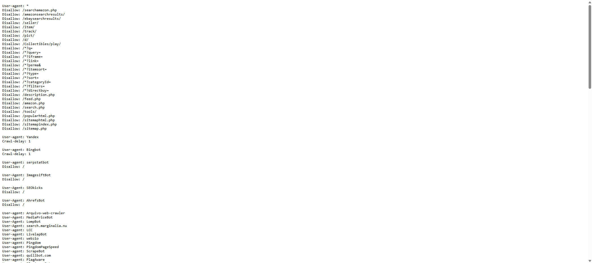
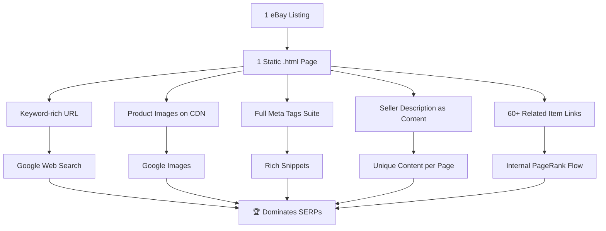

# PicClick SEO Competitive Analysis

> **Goal**: Understand why PicClick dominates Google search results (especially Images) for eBay product queries, and extract actionable strategies for uBuyFirst.
>
> **Date**: 2026-02-10
> **Status**: Initial analysis complete — further exploration items listed in Section 11.

---

## 1. Google Search Domination — What We See



- **Every single result** on page 1 is a PicClick page — individual item pages AND aggregate "Popular" pages
- **Google Images carousel** at the top shows 3 PicClick images with full product titles beneath
- Rich snippets show **prices**, **star ratings**, and **availability badges** directly in SERPs
- URL breadcrumbs display clean category paths: `picclick.com › ... › Keyboards & Keypads`

---

## 2. URL Architecture — The Foundation

### Item Pages (the SEO workhorse)

```text
https://picclick.com/Logitech-G515-Lightspeed-TKL-Low-Profile-Wireless-Keyboard-136994783134.html
```

| Element | Strategy |
|---|---|
| **Keywords in URL** | Full product name hyphenated as slug |
| **eBay Item ID** | Appended at the end (136994783134) — unique per listing |
| **`.html` extension** | Static-file appearance → Google trusts `.html` pages more than query-string URLs |
| **No query parameters** | Clean, flat URLs — no `?q=`, `?id=`, etc. |

### Popular/Category Pages
```text
https://picclick.com/Popular/logitech-transporter
```
- Pre-generated landing pages for popular search terms
- Title pattern: `"Logitech Transporter FOR SALE! - PicClick"`
- These act as **programmatic SEO pages** — one per popular keyword combo

> [!IMPORTANT]
> **Key Takeaway**: Each eBay listing gets its own static-looking `.html` page. This is the #1 reason PicClick has millions of indexed pages. They essentially mirror eBay's entire catalog as their own SEO-optimized pages.

---

## 3. Meta Tags — Textbook Execution

### Title Tag
```text
LOGITECH G515 LIGHTSPEED TKL Low Profile Wireless Keyboard, Black *NO DONGLE* $34.95 - PicClick
```
- Includes: **product name + price + brand**
- Price in title → attracts clicks from price-conscious searchers

### Meta Description
```text
LOGITECH G515 LIGHTSPEED TKL Low Profile Wireless Keyboard, Black *NO DONGLE* - $34.95.
FOR SALE! Missing dongle... Item SKU: S292663. VERY GOOD CONDITION...
```
- Pulls **seller's actual description** → unique content per page
- Includes price, condition, seller details — all click-magnets

### Robots Meta
```html
<meta name="robots" content="max-snippet:-1, max-image-preview:large">
```

| Directive | Effect |
|---|---|
| `max-snippet:-1` | Allows Google to show **unlimited text** in snippets |
| `max-image-preview:large` | Tells Google to use **large image thumbnails** in search results |

> [!CAUTION]
> **This is critical for Google Images ranking.** The `max-image-preview:large` directive explicitly grants Google permission to show large image previews. Without this, Google may only show small thumbnails or no image at all.

---

## 4. Image SEO — Why Their Pictures Are Everywhere

### Dedicated Image CDN
```text
https://www.picclickimg.com/fkIAAeSwlv9pexDv/Logitech-G515-Lightspeed-TKL-Low-Profile-Wireless-Keyboard.webp
```

| Element | Detail |
|---|---|
| **Separate CDN domain** | `picclickimg.com` — dedicated image hosting |
| **Keywords in image URL** | Full product name hyphenated in the image filename |
| **WebP format** | Modern, compressed format → faster loading |
| **Consistent dimensions** | 280×280px for thumbnails |

### Alt Text — 100% Coverage
- **494 images** on a single item page
- **ALL 494 have alt text** — 100% coverage
- Alt text = full product title: `"Logitech G515 Lightspeed TKL Low Profile Wireless Keyboard, Black *NO DONGLE*"`

### Loading Strategy
- Primary product images: `loading="eager"` — loads immediately
- Related/similar items: default loading — lazy-loaded

### Open Graph Image
```html
<meta property="og:image" content="https://www.picclickimg.com/.../Logitech-G515-...Keyboard.webp">
```
- Keyword-rich OG image URL for social sharing and Google Discovery

> [!TIP]
> **Why this works**: Google Images indexes images based on **filename**, **alt text**, **surrounding context**, and **page authority**. PicClick nails all four:
> 1. Keyword-rich image filenames on CDN
> 2. 100% alt text coverage with full product names
> 3. Product title in H1, meta description, and body text
> 4. `.html` pages with clean URLs on a high-authority domain

---

## 5. Open Graph & Social Meta (Full Suite)

```html
<meta property="og:title" content="Logitech G515 ... *NO DONGLE* • $34.95">
<meta property="og:type" content="product">
<meta property="og:site_name" content="PicClick">
<meta property="og:url" content="https://picclick.com/Logitech-G515-...-136994783134.html">
<meta property="og:description" content="...full seller description...">
<meta property="og:price:amount" content="34.95">
<meta property="og:price:currency" content="USD">
<meta property="og:image" content="https://www.picclickimg.com/.../Keyboard.webp">

<meta name="twitter:card" content="summary_large_image">
<meta name="twitter:site" content="@PicClick">
<meta name="twitter:title" content="Logitech G515 ...">
<meta name="twitter:image" content="https://www.picclickimg.com/.../Keyboard.webp">
```

- `og:type = "product"` — tells Facebook/Google this is a product page
- `og:price:amount` + `og:price:currency` — enables price display in social shares
- `twitter:card = "summary_large_image"` — large preview on Twitter/X

---

## 6. Page Content Architecture

### Heading Hierarchy

| Level | Content |
|---|---|
| **H1** | Product title (one per page) |
| **H2** | "PicClick Insights" section + "More Like This" |
| **H3** | Related product titles (Amazon suggestions) |

### Content Sections on Item Page



1. **Product images** (1-3 seller photos with "See More" link)
2. **CTA buttons**: "See Details on eBay" + "Available at Amazon"
3. **Product title** as H1
4. **Price + Buy It Now / Best Offer** buttons
5. **Seller info**: feedback score, location, shipping details
6. **Full seller description** — pulled from eBay (unique text per page!)
7. **"PicClick Insights"** — proprietary content:
   - Popularity stats (watchers, views per day)
   - Best Price comparison vs. similar items
   - Seller rating with link count
8. **"More Like This"** — massive grid of ~60 related items (huge internal linking!)
9. **Amazon affiliate products** — additional monetization

### Internal Linking — Massive Scale
- **236 internal links** on a single item page
- "More Like This" grid provides 60+ cross-links to related PicClick item pages
- Category breadcrumbs link back to category pages
- Every item thumbnail links to another `.html` page

---

## 7. `robots.txt` Strategy — Surgical Crawl Control



### What They BLOCK from crawling:
```text
Disallow: /*?q=              ← search result pages (duplicate content)
Disallow: /*?query=          ← search result pages
Disallow: /*?sort=           ← sorted versions (duplicates)
Disallow: /*?categoryId=     ← filtered versions
Disallow: /*?filters=        ← filtered versions
Disallow: /search.php        ← internal search
Disallow: /seller/           ← seller pages
Disallow: /item/             ← old item URLs?
Disallow: /d/                ← unknown path
Disallow: /feed.php          ← feeds
Disallow: /sitemap.php       ← sitemap generator
Disallow: /sitemapindex.php  ← sitemap pages
```

### What They ALLOW (by omission):
- ✅ Individual item pages (`/*.html`)
- ✅ `/Popular/*` landing pages
- ✅ Category paths

### Bot Blocking — Aggressive
They block **100+ SEO analysis bots** including:
- AhrefsBot, SemrushBot, DotBot, MJ12bot, BLEXBot
- Scrapy, HTTrack, Cloudflare bots, CCBot
- This **hides their strategy** from competitor analysis tools!

### Sitemap
```text
Sitemap: https://picclick.com/sitemapindex.xml
```

> [!NOTE]
> **The strategy**: Only allow Google to crawl the **high-value static pages** (item `.html` pages and Popular pages). Block all dynamic/filtered/search result pages to prevent **crawl budget waste** and **duplicate content penalties**.

---

## 8. Multi-Country TLD Strategy

PicClick runs separate domains per country, each targeting local eBay inventory:

| Domain | Market |
|---|---|
| `picclick.com` | 🇺🇸 USA & International |
| `picclick.co.uk` | 🇬🇧 United Kingdom |
| `picclick.de` | 🇩🇪 Germany |
| `picclick.fr` | 🇫🇷 France |
| `picclick.it` | 🇮🇹 Italy |
| `picclick.es` | 🇪🇸 Spain |
| `picclick.ca` | 🇨🇦 Canada |
| `picclick.com.au` | 🇦🇺 Australia |

Each has its own domain authority, local backlinks, and country-specific eBay content.

---

## 9. What's Notably MISSING

> [!IMPORTANT]
> **CORRECTION (2026-02-10)**: Live HTML analysis via curl revealed that PicClick **DOES** use extensive schema.org **microdata** (Product, Offer, AggregateRating, BreadcrumbList). The initial analysis only checked for JSON-LD `<script>` tags and missed the embedded microdata attributes. See `picclick-live-signals-report.md` Section B for full details.

| Missing Element | Impact |
|---|---|
| **JSON-LD structured data** | No JSON-LD (uses microdata instead — Google recommends JSON-LD) |
| **Hreflang tags** | No visible cross-country linking signals |
| **AMP pages** | No AMP versions |
| **Brand schema** | No `brand` property on Product microdata |
| **Image in Product schema** | Product image not declared via `itemprop="image"` |
| **Organization schema** | No sitewide Organization/WebSite structured data |

> PicClick's microdata implementation is functional but uses hacks (seller feedback as aggregateRating, dummy "PicClick" review). They actively test fixes based on Google Search Console errors (evidenced by HTML comments).

---

## 10. Actionable Takeaways for uBuyFirst

### 🔴 Must-Have (Critical Impact)

1. **Static `.html`-style URLs per listing**
   - Pattern: `/Brand-Product-Name-Keyword-EbayItemId.html`
   - or Next.js equivalent: `/items/brand-product-name-12345` with clean canonical

2. **`max-image-preview:large` robots meta on every page**
   ```html
   <meta name="robots" content="max-snippet:-1, max-image-preview:large">
   ```

3. **Keyword-rich image filenames + 100% alt text**
   - Don't use `/images/thumb_12345.webp`
   - Use `/images/Logitech-G515-Lightspeed-TKL-Keyboard.webp`
   - Alt = full product title on every image

4. **Full OG + Twitter meta suite on every item page**
   - Include `og:type="product"`, `og:price:amount`, `og:price:currency`

5. **Block search/filter/sort pages in robots.txt**
   - Only let Google crawl canonical item pages

### 🟡 Important (High Impact)

6. **"Popular" landing pages** for top search terms
   - Pre-generated, keyword-optimized pages for common product searches
   - These rank for broad queries while item pages rank for specific ones

7. **Massive internal linking** via "Related Items" grids
   - 50-60+ related product links on every page
   - Distributes PageRank across the entire catalog

8. **Price in title tag**
   - `"Product Name $XX.XX - uBuyFirst"` format

9. **Dedicated image CDN** with keyword-rich URLs
   - Separate subdomain or CDN for images
   - Keywords in image paths, not just alt text

### 🟢 Nice-to-Have (Bonus)

10. **XML Sitemap** with all item pages indexed
11. **Block SEO analysis bots** (Ahrefs, Semrush, etc.) to hide strategy
12. **Multi-country domains** when expanding internationally
13. **"PicClick Insights"-style proprietary content** — adds unique value and text that eBay doesn't have

---

## Summary: Why PicClick Wins



**The core formula:** Each eBay listing = 1 static page with a keyword-rich URL + optimized images + unique seller content + massive internal linking. Multiply by millions of listings = millions of indexed, high-quality pages.

---

## 11. Further Exploration Plan (for agents)

> [!IMPORTANT]  
> The following items were identified during initial analysis but not yet explored. Agents should pick up these tasks to deepen the competitive analysis.

### 🔬 Deep-dive investigations

#### A. Sitemap Structure Analysis
- **URL**: `https://picclick.com/sitemapindex.xml`
- **Goal**: Determine total indexed page count, how item URLs vs Popular URLs are organized, sitemap update frequency
- **Method**: Navigate to sitemap index, count sub-sitemaps, sample entries from each

#### B. Microdata / RDFa Schema Check
- **Goal**: Initial analysis only checked for JSON-LD. PicClick may use **microdata** (`itemtype`, `itemprop`) or **RDFa** embedded in HTML attributes
- **Method**: Use Playwright to run `document.querySelectorAll('[itemtype], [itemprop], [typeof], [property]')` and catalog all schema markup
- **Also check**: Google Rich Results Test on a sample item URL

#### C. Google Images Organic Ranking
- **Goal**: Search `g515 keyboard` on Google Images (without `site:` restriction) and document how many PicClick results appear vs eBay, Amazon, manufacturer, etc.
- **Method**: Navigate to `https://www.google.com/search?tbm=isch&q=g515+keyboard`, screenshot, count PicClick results in first 20
- **Compare**: Same query on Bing Images

#### D. eBay vs PicClick Head-to-Head Comparison  
- **Goal**: Take the SAME eBay listing (e.g., item 136994783134) and compare eBay's page vs PicClick's page for SEO signals
- **Method**: 
  1. Navigate to `https://www.ebay.com/itm/136994783134`
  2. Extract title, meta description, OG tags, image alt text, structured data
  3. Compare side-by-side with PicClick's version of the same item
- **Key question**: Why does Google prefer PicClick's mirror over eBay's original?

#### E. Page Speed / Core Web Vitals Audit
- **Goal**: Measure loading performance of PicClick item pages
- **Method**: Use Playwright to navigate and measure `performance.getEntriesByType('navigation')`, DOMContentLoaded, Largest Contentful Paint
- **Also**: Check `https://pagespeed.web.dev/` for a PicClick URL
- **Compare**: Same metrics for a uBuyFirst public page

#### F. HTTP Response Headers Analysis
- **Goal**: Identify CDN provider, caching strategy, compression, SSR vs CSR signals
- **Method**: Use Playwright `page.on('response')` to capture headers for the main document and image requests
- **Look for**: `Cache-Control`, `X-Powered-By`, `Server`, `Content-Encoding`, `CF-Cache-Status`, `Age`

#### G. Mobile Rendering
- **Goal**: Google uses mobile-first indexing — check how PicClick renders on mobile
- **Method**: Use Playwright browser_resize to 375x812 (iPhone viewport), navigate to item page, screenshot
- **Check**: Viewport meta tag, responsive images, touch targets, text readability

#### H. Content Uniqueness Analysis
- **Goal**: Determine how much of each item page is unique vs. template/boilerplate
- **Method**: Compare 3-5 different item pages, identify which sections change (title, description, images, seller info) vs. which stay the same (footer, nav, "More Like This" structure)
- **Risk assessment**: Is PicClick vulnerable to thin content penalties? Does Google see the seller description as duplicate of eBay?

#### I. Category / Browse Pages Architecture
- **Goal**: Analyze how PicClick organizes its category taxonomy
- **Method**: Navigate to breadcrumb category links (e.g., `Computers/Tablets & Networking > Keyboards, Mice & Pointers > Keyboards & Keypads`)
- **Check**: URL structure, meta tags, pagination strategy, canonical tags on category pages

#### J. Domain Authority & Backlink Profile
- **Goal**: Estimate PicClick's domain authority metrics since direct Ahrefs/Semrush access is blocked
- **Method**: Use web search for "picclick.com domain authority", "picclick.com backlinks", check Moz, or use alternative free DA checkers
- **Compare**: Against uBuyFirst's current domain metrics

#### K. "Popular" Pages — Scale & Pattern
- **Goal**: Understand how many /Popular/ pages exist and how keywords are selected
- **Method**: Search Google for `site:picclick.com/Popular/`, count results, identify naming patterns
- **Question**: Are these auto-generated from search trends, or curated? How frequently are new ones created?

### 📋 Priority Order
1. **D** (eBay vs PicClick head-to-head) — most directly actionable
2. **B** (Microdata check) — might reveal hidden schema we missed
3. **C** (Google Images organic) — validates the image SEO thesis
4. **A** (Sitemap) — reveals scale of indexing
5. **E** (Page speed) — performance baseline
6. **F-K** — secondary investigations
